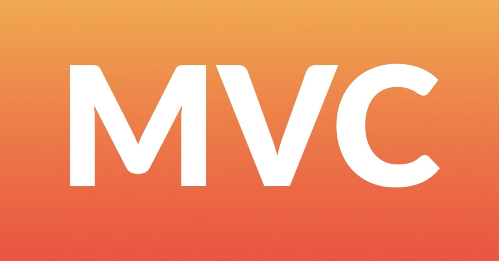

# MVC con PHP
---

Repositorio destinado al estudio del patrón de diseño MVC usando PHP. Encontrarás diversos recursos  y ejercicios variados. Esta presentación se actualiza con cada commit, por lo que debería estar actualizada en todo momento. 

 

---

Referencias 

- [Students Tutorial](https://www.studentstutorial.com/php/mvc/intro)

- [Carlos Alfaro](https://www.youtube.com/playlist?list=PLH_tVOsiVGzlJtytLjp6h6hRpZCxl77-n)

- [render2web](https://www.youtube.com/watch?v=dRLRPi6ClMA&list=PLty0cFLf07jXQA5_P9rDMWjpEet2wTXN1)

- [jonmircha](https://www.youtube.com/playlist?list=PLvq-jIkSeTUZWYh18UN6Q9rfkoqy5A9Xn)

